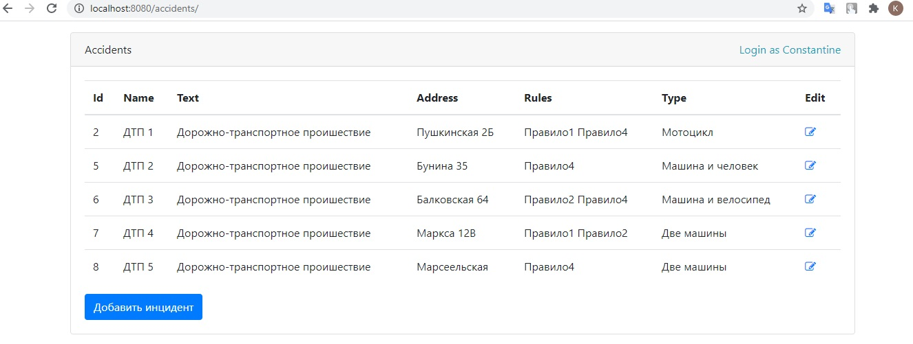
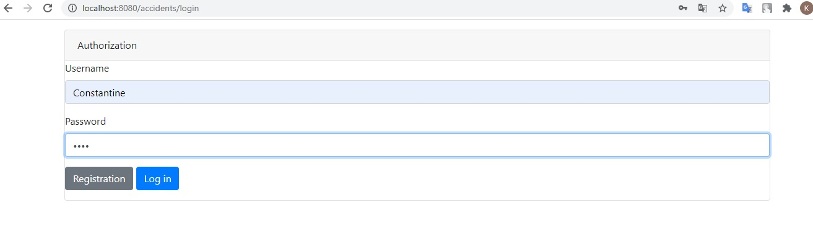

## Car accidents
A web application for the registration of received reports of incidents in the field of traffic regulation.

Used technologies:

 - Java Core
 - Spring 5 (Core, Web, Data, Security)
 - JDBC, Hibernate, PostgreSQL
 - JSP, JSTL
 - HTML5, Bootstrap
 
 
The main page contains a list that shows all the information about road traffic accidents

Incident creation and editing page

_accident.jpg "edit page")

The application implements registration and authentication of users.

